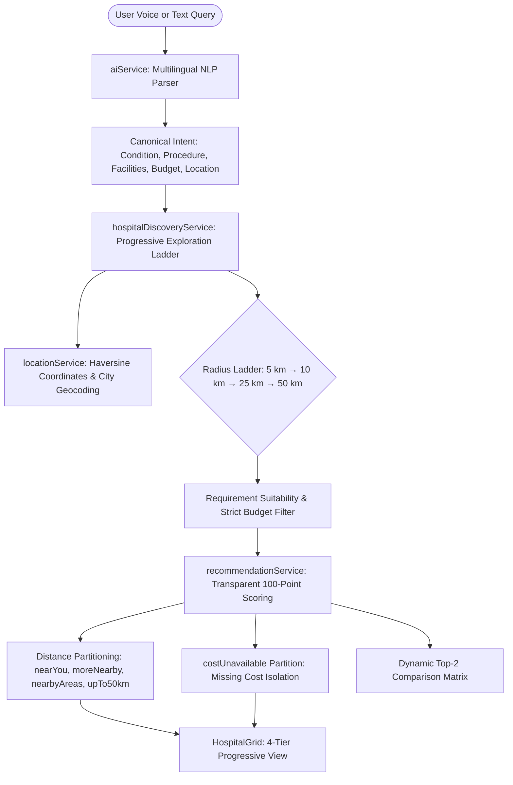

# Sehat_Sathi 

> **Evidence-Based, Local-First Healthcare Discovery & Hospital Performance Engine**  
> Empowering patients and families across Punjab, Chandigarh Tricity, and Northern India with transparent, verified healthcare choices.

[](https://vitejs.dev/)
[](https://reactjs.org/)
[](https://tailwindcss.com/)
[](#automated-testing)
[](LICENSE)

---

## 📌 Table of Contents

- [Vision & Core Principles](#-vision--core-principles)
- [Key Features](#-key-features)
  - [1. 18-Category Medical Taxonomy & Multilingual AI Parsing](#1-18-category-medical-taxonomy--multilingual-ai-parsing)
  - [2. Local-First Progressive Exploration Ladder](#2-local-first-progressive-exploration-ladder)
  - [3. Strict Budget Logic & Unknown Cost Separation](#3-strict-budget-logic--unknown-cost-separation)
  - [4. Source-Verified Clinical Performance & Zero Fabrication](#4-source-verified-clinical-performance--zero-fabrication)
  - [5. Statutory Organisation & Accreditation Verification](#5-statutory-organisation--accreditation-verification)
  - [6. Dynamic Top-2 Comparison Matrix](#6-dynamic-top-2-comparison-matrix)
  - [7. Secure Admin Portal, RBAC & Audit Trails](#7-secure-admin-portal-rbac--audit-trails)
  - [8. 24x7 Emergency & Voice Search](#8-24x7-emergency--voice-search)
- [Transparent 100-Point Scoring Engine](#-transparent-100-point-scoring-engine)
- [System Architecture](#-system-architecture)
- [Directory Structure](#-directory-structure)
- [Getting Started](#-getting-started)
- [Automated Testing](#-automated-testing)
- [Ethical Healthcare Disclaimer](#-ethical-healthcare-disclaimer)

---

## 🎯 Vision & Core Principles

Finding high-acuity medical care during health crises in India often forces families to navigate opaque pricing, aggressive advertising, and unverified hospital claims. **Sehat_Sathi** redefines healthcare discovery with strict algorithmic transparency:

1. **Requirement-First, Not Ad-Driven**: Hospitals are ranked exclusively on how well they fulfill the user's clinical conditions, required facilities, and budget—never on paid sponsorships.
2. **Local-First Exploration**: Uses genuine geographic coordinates and Haversine distance, expanding progressively ($5 \rightarrow 10 \rightarrow 25 \rightarrow 50\text{ km}$) to locate viable treatment options near the patient.
3. **Zero-Fabrication Standard**: Unverified clinical statistics remain strictly `null` and render as `"Data not available"`. Zero cure/success rate claims exist across the platform.
4. **Zero Superlatives Banned Everywhere**: Words like *"Best"*, *"Winner"*, and *"Number 1"* are strictly banned. The system uses neutral, evidence-grounded classifications.
5. **Strict Medical Distinction**: Enforces `Condition ≠ Facility ≠ Procedure` (e.g. *dialysis* is a facility/treatment, not a disease; *kidney transplant* is a surgical procedure).

---

## 🚀 Key Features

### 1. 18-Category Medical Taxonomy & Multilingual AI Parsing
* **Catalogue Coverage** ([`src/data/conditionCatalogue.js`](src/data/conditionCatalogue.js)):
  Spans 18 clinical categories: *Cardiovascular, Neurology, Oncology, Kidney / Urology, Transplant, Liver / Gastroenterology, Respiratory, Orthopedics, Endocrinology, Pediatrics, Women's Health, Eye, ENT, Dermatology, Mental Health, Infectious Disease, Emergency / Critical Care, and General / Multispecialty*.
* **Multilingual Aliases (430+ Variants)**:
  Parses natural language queries in English, Hindi (हिन्दी), Punjabi (ਪੰਜਾਬੀ), and Hinglish (e.g. *"dil ka daura"*, *"gurde ki bimari"*, *"haddi tootna"*, *"lakwa"*).
* **Ambiguity Preservation**:
  Broad requests (e.g. *"brain ka treatment"*) safely map to general neurology (`neurology`) without hallucinating specific diagnoses like brain tumors.

```
"dialysis"                    → condition: null,    procedure: null,               facilities: ['dialysis']
"kidney hospital"             → condition: 'kidney', procedure: null,               facilities: []
"kidney hospital w/ dialysis" → condition: 'kidney', procedure: null,               facilities: ['dialysis']
"kidney transplant hospital"  → condition: 'kidney', procedure: 'kidney_transplant', facilities: []
```

### 2. Local-First Progressive Exploration Ladder
* **Geospatial Ladder**: Evaluates results across $5\text{ km} \rightarrow 10\text{ km} \rightarrow 25\text{ km} \rightarrow 50\text{ km}$.
* **No Premature Exit**: If fewer than 5 matching hospitals exist at 5 km, the search automatically broadens up to 50 km.
* **4 Progressive Distance Tiers** rendered in [`HospitalGrid.jsx`](src/components/hospital/HospitalGrid.jsx):
  1. **Near You** ($\le 5\text{ km}$)
  2. **More Nearby** ($> 5\text{--}10\text{ km}$)
  3. **Nearby Areas** ($> 10\text{--}25\text{ km}$)
  4. **Wider Region** ($> 25\text{--}50\text{ km}$)
* **Geographic Flexibility**: Explicit city selection (e.g. *Jalandhar*, *Hoshiarpur*, *Ludhiana*, *Chandigarh*) anchors discovery directly to that city's coordinates, overriding device GPS.

### 3. Strict Budget Logic & Unknown Cost Separation
* **Zero Arbitrary Multipliers**: Stated budgets (e.g. *"under ₹1,00,000"*) are evaluated strictly against baseline minimum procedure costs.
* **Cost-Unavailable Isolation**: Hospitals matching the medical condition and facilities that lack verified pricing are separated into:
  > **"Relevant Options — Cost Data Not Available"**
* **Zero ₹0 Hallucinations**: Missing costs are never treated as ₹0, and unrecorded costs never falsely satisfy a budget constraint.
* **Dual Header Counter**: `"X confirmed budget matches + Y relevant hospitals with unavailable cost"`.

### 4. Source-Verified Clinical Performance & Zero Fabrication
* **Clinical Performance Schema (`conditionPerformance`)**:
  Captures structured, audit-ready metrics (e.g. *STEMI Door-to-Balloon $\le 90\text{ min}$*, *Dialysis Adequacy $\text{Kt/V} \ge 1.2$*, *Radiation Therapy Course Completion*).
* **Mandatory Audit Attributes**:
  Every metric requires explicit definition, cohort population, reporting period, integer numerator/denominator, and traceable source citation.
* **Neutral Evidence Tiers**:
  * `Verified Outcome Data Available`
  * `Relevant Condition-Specific Evidence`
  * `Strong Requirement Match`

### 5. Statutory Organisation & Accreditation Verification
* **Multi-Field Identity Matching**:
  Accreditation searches require concordance across `hospital name + address + city + state + pincode` via [`adminService.js`](src/services/adminService.js).
* **Strict Independence**:
  * Having dialysis machines on-site does **not** infer PMNDP (Pradhan Mantri National Dialysis Programme) enrollment.
  * Nephrology departments do **not** infer NABH hospital accreditation.
  * NABH hospital accreditation does **not** confer NABL laboratory accreditation.
* **Lifecycle Statuses**: `verified`, `sample_data`, `unverified`, `not_found`, `expired`, `conflicting`, `pending_review`.

### 6. Dynamic Top-2 Comparison Matrix
* **Derived from Live Search Results**:
  Automatically selects the top 2 scored hospitals from the active query and displays a prominent comparison banner.
* **Stale Comparison Guard**:
  Changing queries, budget filters, or location coordinates immediately clears previous candidates and recalculates fresh pairs.
* **Side-by-Side Comparison Table** ([`ComparisonTable.jsx`](src/components/compare/ComparisonTable.jsx)):
  Compares Requirement Match scores, emergency readiness, individual facilities, verified accreditations, baseline procedure costs, and condition performance metrics.

### 7. Secure Admin Portal, RBAC & Audit Trails
* **Route Guards & Session State**:
  [`AdminProtectedRoute.jsx`](src/components/admin/AdminProtectedRoute.jsx) restricts `/admin/*` routes to authenticated sessions with appropriate permissions.
* **Role-Based Access Control (RBAC)**:
  * `admin`: Full administrative governance, soft-deletion, and metric configuration.
  * `editor`: Hospital record creation and detail modification.
  * `reviewer`: Audit log inspection and verification review.
* **Soft-Deletion Safeguards**:
  Hospitals cannot be hard-deleted. Administrative deactivation applies `isActive: false`, `deactivationReason`, `deletedAt`, and writes an immutable audit log entry.
* **Admin Metric Validation**:
  `validateConditionOutcomeMetric` verifies that outcome values lie between 0–100%, numerators do not exceed denominators, and source citations are non-empty.

### 8. 24x7 Emergency & Voice Search
* **Emergency Mode** ([`EmergencyPage.jsx`](src/pages/EmergencyPage.jsx)):
  One-tap proximity search that sorts all open 24x7 emergency and trauma centers strictly by distance.
* **Voice Search** ([`voiceSearchService.js`](src/services/voiceSearchService.js)):
  Integrated speech-to-text supporting queries in English, Hindi, and Punjabi with automated microphone fallback.

---

## 📊 Transparent 100-Point Scoring Engine

Hospital match scores are calculated dynamically using an open, non-diagnostic 100-point index in [`recommendationService.js`](src/services/recommendationService.js):

$$\text{Total Match Score} = \text{Specialty} + \text{Facilities} + \text{Budget} + \text{Distance} + \text{Emergency} + \text{Verification}$$

| Criterion | Max Points | Evaluation Logic |
|---|:---:|---|
| **Specialty & Condition** | **30** | Dedicated clinical specialty department matching requested condition. |
| **Required Facilities** | **25** | Proportion of explicitly requested facilities (ICU, Cath Lab, MRI, Dialysis, etc.) present. |
| **Budget Compatibility** | **20** | Verified baseline procedure cost $\le$ stated budget limit. |
| **Geographic Proximity** | **15** | $\le 5\text{ km} = 15\text{ pts}$; $\le 10\text{ km} = 12\text{ pts}$; $\le 25\text{ km} = 8\text{ pts}$; $\le 50\text{ km} = 4\text{ pts}$. |
| **24x7 Emergency** | **5** | Active round-the-clock emergency department and resuscitation unit. |
| **Verified Institutional Audit** | **5** | Verified statutory registration or direct institutional audit records. |
| **Total Maximum** | **100** | *(Score clamped between 10–98 to prevent misleading claims of 100% medical perfection).* |

> **Note**: Condition performance metrics populate explanatory narratives and assign evidence tier tags, but **do not** inject hidden score points.

---

## 🏛 System Architecture



---

## 📁 Directory Structure

```text
Sehat_Sathi/
├── dist/                          # Production build output
├── public/                        # Static assets & icons
├── src/
│   ├── components/
│   │   ├── admin/                 # Admin protected route guards & modals
│   │   ├── common/                # Header, Footer, Navbar, Badges
│   │   ├── compare/               # Side-by-side comparison tables
│   │   ├── hospital/              # Hospital cards, grid, badges, stats
│   │   └── search/                # Search bar, filters, sort selector
│   ├── context/
│   │   ├── AdminAuthContext.jsx   # Session-based admin auth & RBAC
│   │   ├── ComparisonContext.jsx  # Dynamic Top-2 & custom comparison state
│   │   ├── LocationContext.jsx    # GPS / manual location state
│   │   └── ToastContext.jsx       # Alert notifications
│   ├── data/
│   │   ├── conditionCatalogue.js  # 18 categories, 41 conditions, 10 procedures
│   │   ├── facilities.js          # Facility taxonomy
│   │   ├── hospitals.js           # Master hospital dataset (Punjab, Tricity)
│   │   ├── specialties.js         # Medical specialties
│   │   └── treatments.js          # Treatment procedures
│   ├── pages/
│   │   ├── admin/                 # Dashboard, hospital management, audit logs
│   │   ├── AboutPage.jsx          # Transparency disclaimer & mission
│   │   ├── ComparePage.jsx        # Comparison screen
│   │   ├── EmergencyPage.jsx      # 24x7 Emergency discovery
│   │   ├── HomePage.jsx           # Landing page with multilingual search
│   │   ├── HospitalDetailPage.jsx # Individual hospital profiles & clinical metrics
│   │   └── SearchResultsPage.jsx  # Main discovery view with 4-tier ladder
│   ├── services/
│   │   ├── adminService.js        # RBAC, audit logging, metric validation
│   │   ├── aiService.js           # Multilingual query parsing & intent extraction
│   │   ├── hospitalDiscoveryService.js # Progressive radius & distance bucketing
│   │   ├── locationService.js     # Haversine distance & geocoding
│   │   ├── recommendationService.js # 100-pt scoring & evidence tiers
│   │   ├── searchService.js       # Search orchestrator
│   │   └── voiceSearchService.js  # Web Speech API speech-to-text
│   ├── App.jsx                    # Application routing
│   └── main.jsx                   # React root entry point
├── tests/
│   └── run_tests.js               # Comprehensive 14-suite automated test runner
├── package.json                   # Project metadata & dependencies
├── tailwind.config.js             # Tailwind CSS configuration
└── vite.config.js                 # Vite bundler configuration
```

---

## 🛠 Getting Started

### Prerequisites
* **Node.js**: `v18.0.0` or higher
* **npm**: `v9.0.0` or higher

### Installation & Development

1. **Clone the repository**:
   ```bash
   git clone https://github.com/your-username/sehat-sathi.git
   cd sehat-sathi
   ```

2. **Install dependencies**:
   ```bash
   npm install
   ```

3. **Start the local development server**:
   ```bash
   npm run dev
   ```
   Open [http://localhost:5173](http://localhost:5173) in your browser.

4. **Build for production**:
   ```bash
   npm run build
   ```

5. **Preview the production build**:
   ```bash
   npm run preview
   ```

---

## 🧪 Automated Testing

Sehat_Sathi contains an extensive automated test runner validating the end-to-end medical search engine, distance formulas, statutory verification rules, and administrative governance.

Run all tests from the project root:
```bash
npm test
```
*Or directly via Node:*
```bash
node tests/run_tests.js
```

### Test Coverage (175 Tests across 14 Suites):

| Suite | Focus Area | Tests |
|:---:|---|:---:|
| **1** | Location Geocoding & City Resolution | 6 |
| **2** | Haversine Distance Calculation & Coordinate Bounds | 12 |
| **3** | Multilingual Search & Query Parsing | 24 |
| **4** | Progressive Radius Search & Suitability Enforcement | 15 |
| **5** | Dialysis Facility vs PMNDP Independence | 12 |
| **6** | Dynamic Comparison & Top-2 State Management | 14 |
| **7** | 24x7 Emergency Proximity Discovery | 8 |
| **8** | Transparent 100-Point Scoring & Evidence Weights | 10 |
| **9** | Jalandhar & Hoshiarpur Hospital Dataset Integrity | 18 |
| **10** | Admin Service: RBAC, Input Validation & Soft-Delete | 12 |
| **11** | Condition Performance Schema & Zero-Fabrication Checks | 8 |
| **12** | Voice Search Parameter Mapping & Fallbacks | 6 |
| **13** | Organisation Affiliation Verification & Audit Logging | 20 |
| **14** | Expanded Medical Taxonomy & Progressive Distance Buckets | 10 |
| **Total** | **All 14 Test Suites Passed** | **175 / 175** |

---

## ⚖️ Ethical Healthcare Disclaimer

Sehat_Sathi is an informational healthcare navigation engine designed to help users identify healthcare infrastructure, facilities, and published audit records near their location.

* **Non-Diagnostic**: Sehat_Sathi does not provide medical diagnoses, treatment recommendations, clinical consultations, or triage assessments.
* **Emergency Advice**: In life-threatening emergencies, patients should immediately contact national emergency services (**112** or **108** in India) or report to the nearest hospital emergency room.
* **Independent Verification**: Hospital bed counts, active accreditations, and procedural costs should be confirmed directly with the healthcare provider prior to admission.

---

## 📄 License

This project is licensed under the [MIT License](LICENSE).
